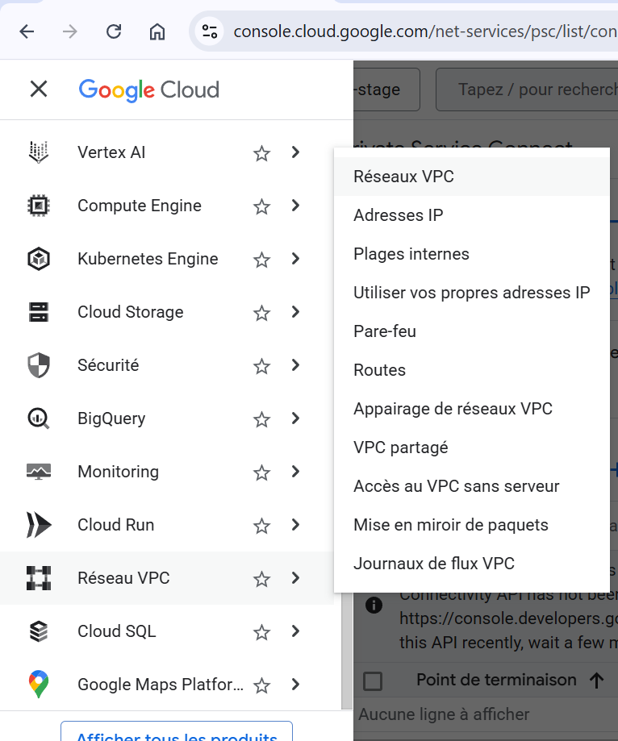
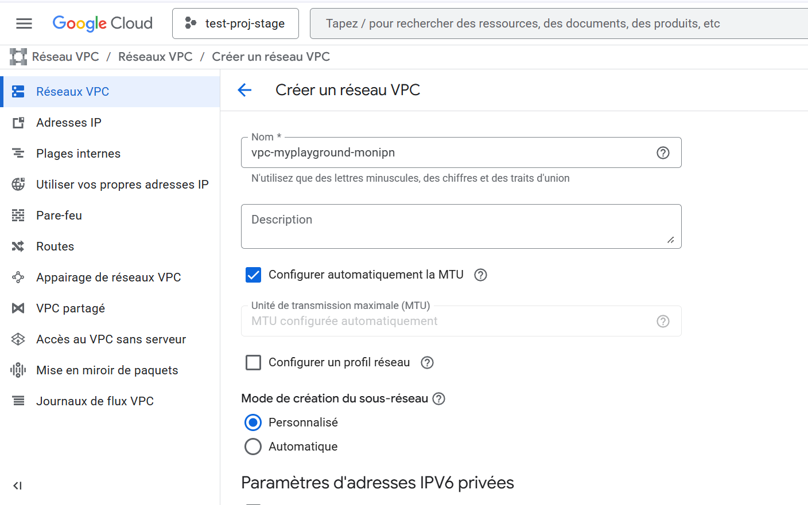
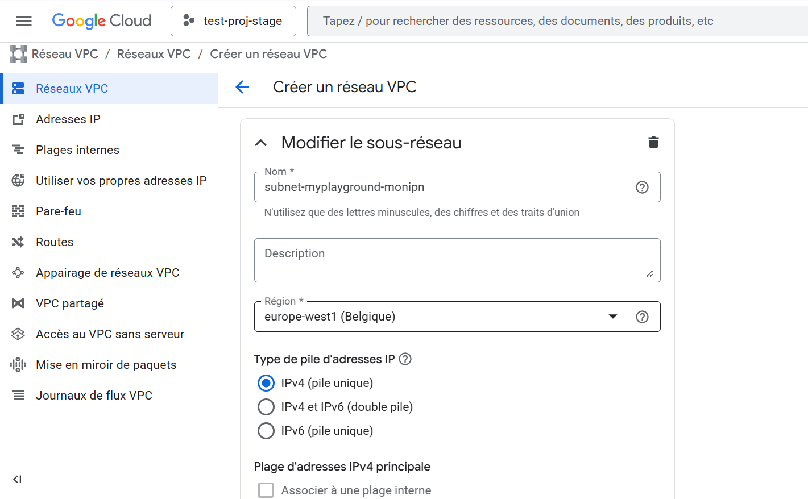
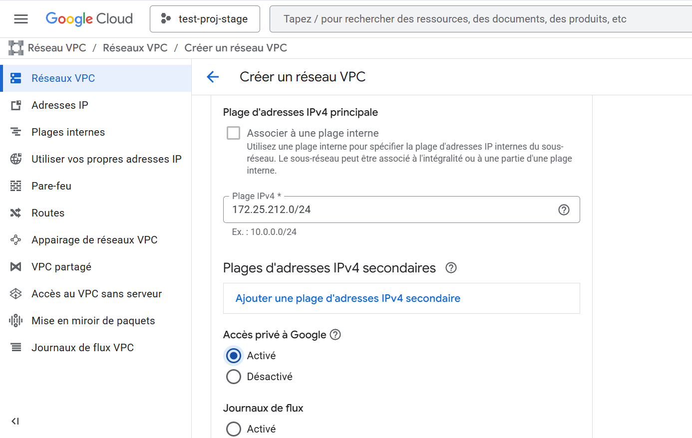
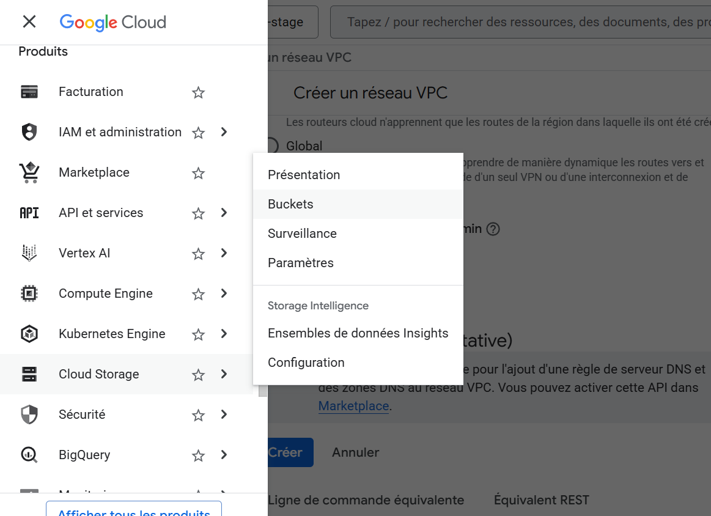
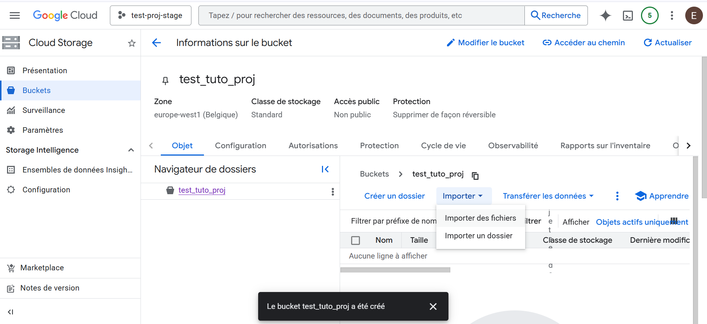
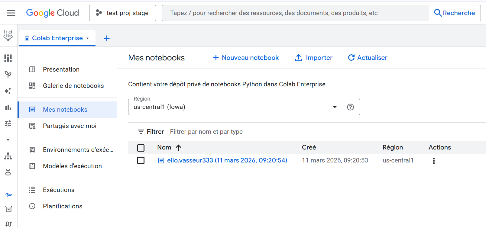
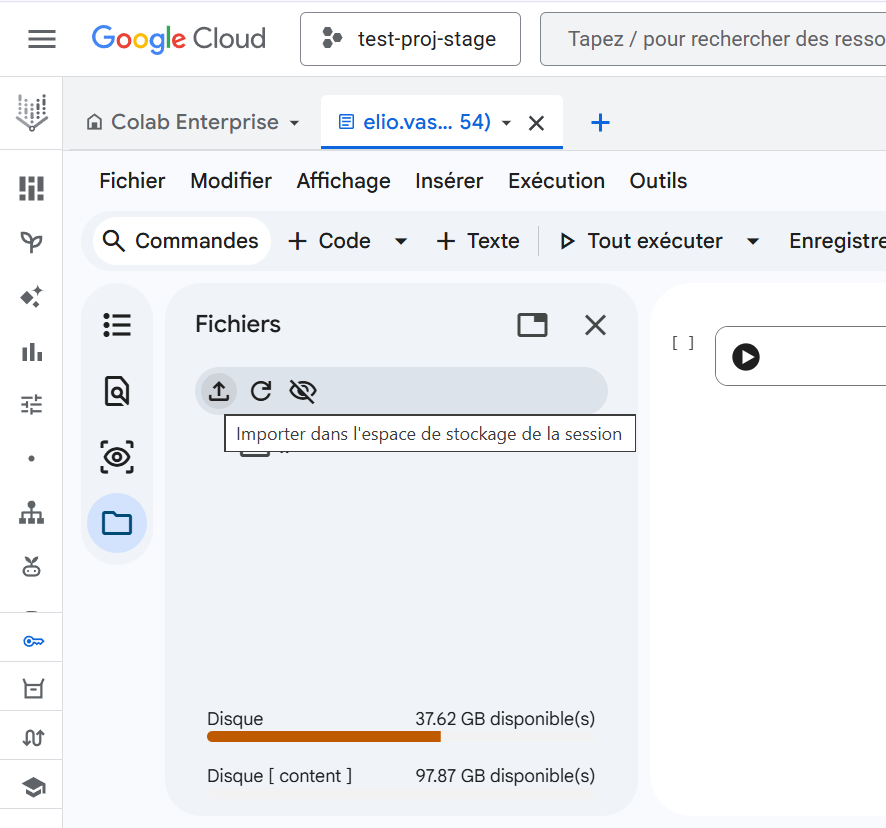

# Tuto faire fonctionner un notebook GCP :dizzy:

### Step 1: Créer un VPC (Virtual Private Cloud)

Dans la barre latérale de la console GCP, défilez vers le bas jusqu'à trouver *"Réseaux VPC"*.

Cliquez sur *"Réseaux VPC"* puis sur *"Créer un réseau VPC"*. Saisissez un nom pour votre réseau, type vpc-myplayground-VOTREIPN, puis laissez les cases suivantes en l'état. 

Défilez jusqu'à la section "Sous-réseaux". Remplissez les informations comme suit :

* Nom : subnet-myplayground-VOTREIPN (par exemple)
* Région : europe-west1 (Belgique)
* Plage IPv4 : 172.25.212.0/24 

**Veillez à cocher le case "Activé" pour *"Accès privé à Google"***. 

En ce qui concerne la plage IPv4, il s'agit là de la même plage que l'IP de la caméra utilisée pour les tests. Vous pouvez en choisir une autre à votre guise. 

  
  

Cliquez sur OK (optionnel) pour finaliser la partie sous-réseau.

Défilez vers le bas de la page et cliquez sur *"Créer"*.

Vous venez de créer un réseau et un sous-réseau, pour l'instant vides.

### Step 2: Créer un Bucket (à la vérité, probablement optionnel, mais toujours utile)

Pour importer des fichiers, il faut un récipient : le bucket.

Dans la barre latérale de la console GCP, remontez et sélectionnez *"Cloud Storage"*, puis *"Buckets"*. 

Cliquez sur *"Créer"*, trouvez lui un nom unique, type bucket-myplayground-VOTREIPN ou autre si pas disponible.

Laissez toutes les cases en l'état, cliquez sur *"Continuer"* pour chaque section, enfin cliquez ensuite sur *"Créer"*.

Retournez dans l'onglet *"Buckets"* si vous n'y êtes pas déjà, puis cliquez sur votre nouveau bucket dès qu'il aura été créé. L'onglet sera peut être déjà ouvert. Cliquez ensuite sur importer puis sélectionnez les fichiers de votre choix.

Validez puis patienteZ le temps de l'importation.

### Step 2.5: Activer l'API Gemini

Pour utiliser le notebook de test, il faut activer l'API Gemini dans Google Cloud. 
Pour ce faire, tapez Gemini API dans la barre de recherche. 
Cliquez sur le premier résultat Marketplace puis sur *"Activer"*.

### Step 3: Importer et faire tourner le notebook

Dans la barre latérale, cliquez sur *"Vertex AI"* puis *"Colab Enterprise"*, en bas. Une fenêtre vous demandera peut être d'activer les API nécessaires pour utiliser cet onglet. Si ça n'est pas déjà fait, activez les.
Cliquez sur mes notebooks puis Importer. Sélectionnez le notebook de votre choix. 

Une fois importé, ouvrez le en cliquant dessus s'il n'est pas déjà ouvert. 

Pour importer vos fichiers cliquez ensuite sur le logo dossier dans la barre de gauche. Vous devrez normalement sélectionner votre réseau puis sous-réseau, puis valider. 

Cliquez ensuite sur le logo importer puis sélectionnez les fichiers de votre choix.

:warning: Si vous décidez de les placer dans un répertoire différent du répertoire par défaut (var/), vous devrez changer le chemin d'accès dans le code du notebook.

Vous avez normalement toutes les clés en main : votre réseau et sous-réseau avec accès privé à Google, vos fichiers importés dans l'espace Google Colab, et votre notebook prêt à tourner.

Si vous avez apporté des modifications à cet environnement, vérifiez que les variables définies dans le code soient correctes.

Vous pouvez ensuite cliquer sur *"Tout éxécuter"*.

### Step 4 (optionnel): Aller plus loin

Vous pouvez modifier le notebook à votre guise. Modifier le prompt et l'image envoyés à l'agent etc.

Ce [lien](https://googleapis.github.io/python-genai/) documente diverses utilisation de la bibliothèque GenAI sur GCP. 

